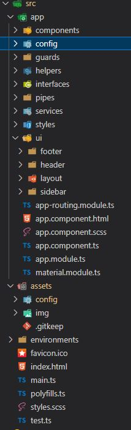
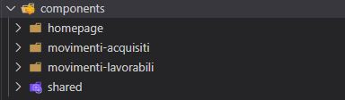
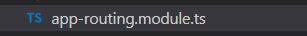
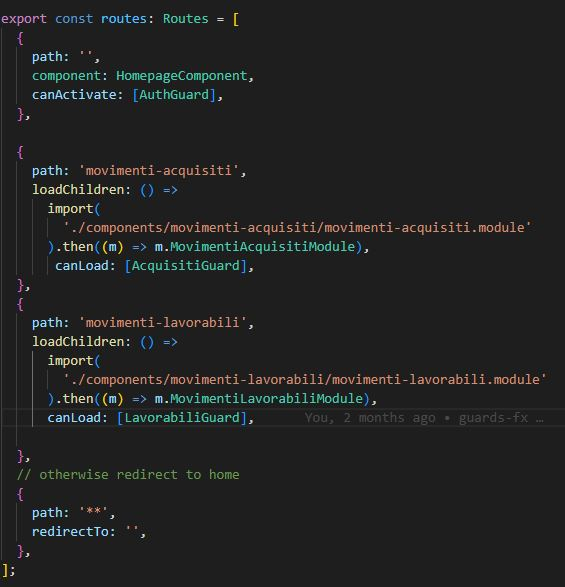

# SCHEMA RIASSUNTIVO GEPA

Breve resoconto di come è strutturata lato Front End Gepa:

1. `Struttura generale del progetto`
2. `Routing, lazy loading e moduli`
3. `Ambienti, autenticazione e wso2, profili`
4. `Permessi e Ribbon`
5. `Utenti e funzioni`
6. `Gestione dati`
7. `Panoramica generale dei servizi`
8. `Introduzione all'interfaccia grafica`

---

  
  
  
  
  
  
  
  
  
  
  
  
  
  
  
  
  
  
  
  
  
  
  
  
  
  
  
  
  
  
  

## 1. STRUTTURA GENERALE DEL PROGETTO

### 1.1 **Un primo sguardo**

Questa è l'architettura generale del progetto e la sua divisione in cartelle:
 

## 

- nella cartella `components` ci sono appunto tutti i componenti del progetto, quelli facenti parte i diversi moduli e quelli 'condivisi' tra questi.
- la cartella `config` contiene, appunto, le congigurazioni necessarie per far girare l'applicazione, in particolar modo le configurazioni dell'autenticazione.
- la cartella `guards` contiene ovviamente le guards che gestiscono l'accesso alle rotte, e comprendono sia l'autenticazione generale per acceder all'applicativo sia la gestione interna dei permessi di accesso alle singole rotte.
- all'interno di `helpers` c'è un _interceptor_, che si occupa di intercettare le chiamate rivolte al BE per aggiungervi i token necessari
- `interfaces` contiente alcune delle interfacce utilizzate nel progetto.
- dentro `pipes` invece troviamo appunto le pipes.
- dentro `services` abbiamo i servizi utilizzati nel progetto, che svolgono differenti funzioni.
- `styles` contiene i fogli di sile scss
- `ui` invece contiene i componenti base del layout, _footer_ e _header_
- `assets` contiene le immagini base dell'applicativo e le configurazioni necessarie per il funzionamento del progetto sui diversi ambienti

 

### 1.2 **Componenti**

La cartella `components` contiene appunto tutti i componenti dell'applicativo, ed è divisa a sua volta in 4 sottocartelle.

## 

Le prime tre corrispondono alle tre _'sezioni'_ in cui è diviso l'applicativo, `'homepage'`, `'movimenti-acquisiti'` e `'movimenti-lavorabili'`, mentre l'ultima cartella, `'shared'`, contiene i componenti comuni alle varie sezioni.

 
 
 

## 2. ROUTING, LAZY LOADING E MODULI

Il routing dell'applicativo è gestito attraverso il _lazy loading_ ed è gestito nell' `app-routing-module`.

## 

Che prevede 3 routes principali:

- `''` un path vuoto per la homepage, che non prevede lazyloading
- `'movimenti-acquisiti'`, e le sue rispettive _sotto-rotte_ (nell'immagine sotto) che vengono caricate con il rispettivo modulo nel caso si disponga del permesso per accedervi
- `'movimenti-lavorabili'` , e le sue rispettive _sotto-rotte_ che vengono caricate con il rispettivo modulo nel caso si disponga del permesso per accedervi

> per un approfondimento specifico sulle guards e sui permessi consultare i due capitoli successivi (`cap.3` - `cap.4`)

oltre all'`app-module` e ai moduli `movimenti-acquisiti` e `movimenti-lavorabili` all'interno della cartella `'shared'` c'è un terzo modulo che contiene invece i componenti _'comuni_' agli altri due, ed è `'shared-module'`.

<!--
Inoltre `movimenti-acquisiti` e  `movimenti-lavorabili` hanno una loro suddivisione in rotte, ognuna delle quali protetta in base ai permessi necessari per accedervi. -->

 
 
 

## 3. Ambienti, autenticazione, wso2 e profili

### 3.1 **Ambienti**

Per quanto riguarda l'impostazione del progetto e il suo diverso comportamento in locale o in ambiente di test bisogna dare un occhio alla cartella `'config'` dentro `'assets'`:

al suo interno ci sono 3 json che ci permettono di cambiare velocemente da ambiente di test a locale senza problemi:

> `env.test.json` contiene le variabili per il funzionamento in locale.

> `env.variables.json` contiene le variabili per il funzionamento in test

> `env.json` invece indica quale delle due precedenti configurazioni è _'attiva'_ semplicemente valorizzando la sua unica proprietà `'env'` con il _'nome'_ del json da utilizzare, `'test'` in locale (come in foto) o `'variables'` per l'ambiente di test.

Queste configurazioni vengono riprese da `app.config.ts` (all'interno della cartella `'config'` dentro la cartella `'app'`) che all'avvio, tramite una chiamata _'interna'_, carica le impostazioni settate nei json.

 

### 3.2 **Autenticazione e wso2**

L'intero sistema di autenticazione è basato su Wso2 ed gestito lato frontend grazia a `'angular-oauth2-oidc'`.  
Una volta avviato l'applicativo, come abbiamo visto nel capitolo precedente, le rotte saranno protette dalla _guard_ `'auth.guard.ts'` che controllerà subito se siamo autorizzati e autenticati.

    canActivate(route: ActivatedRouteSnapshot, state: RouterStateSnapshot) {

        return this.authService.isLoggedIn();
    }

verremo quindi _'rinviati'_ al servizio `auth.service.ts` che, nel caso in cui l'utente in questione non è loggato, ci rimanda all'interfaccia della Login gestita da wso2.

 

> **NOTA BENE**  
> In locale per il meccanismo di autenticazione è necessario far girare wso2 sulla propria macchina, che necessita una sua configurazione.

Nella cartella di wso2 c'è una cartella bin al cui interno c'è un file _`wso2server.bat`_, che va modificato in base alla propria macchina.

    wso2am-2.2.0_eqt\bin\wso2server.bat

Alla prima riga del file c'è una variabile _'AdERJWTGeneratorPath'_ che va settata uguale al path della cartella che contiene i file jwt che corrispondolo alla profilazione dei diversi tipi di utenti e annessi ambiti e funzionalità.

per esempio, in questo caso la mia cartella _jwt_ sarà:

e i file al loro interno saranno AderGepa\__nome-ruolo-maiuscolo_.properties

con il codice fiscale dell'utente, i suoi ambiti e le sue funzionalità.

Attraverso wso2 il backend riceverà nelle chiamate un jwt nell'header, necessarie per rispondere alle prime chiamate che il frontend effettua una volta autenticato, sempre nel servizio `auth.service.ts`.

> `/home` - dal servizio `userdata.service.ts`, che riceve e salva i dati anagrafici dell'utente loggato e che finchè non va a buon fine impedisce all'interfaccia di caricarsi.

> `/utente/permessiUtente` - dal servizio `permessi.service.ts`, che riceve e salva i permessi dell'utente loggato.

 
 
 

## 3. Permessi e Ribbon

### 3.1 **Permessi**

I permessi gestiscono l'accesso alle sezioni dell'applicativo a seconda dei diversi utenti, e in alcuni casi a cambiare l'interfaccia di una determinata a seconda dell'utente loggato.

E sono:

> _`acqquadsdb`_ : acquisizione quadratura sblocco -> permette l'accesso completo alla sezione _"movimenti acquisiti"_ e a quella dell'inserimento manuale, e l'accesso in lettura alla sezione _"moviventi lavorabili"_.

> _`insman`_ : inserimento manuale - permette l'accesso esclusivamente alla sezione per l'inserimento di un nuovo movimento.

> _`gesmov`_ : gestione movimenti - permette l'accesso in lettura e scrittura alla sezione _"movimenti lavorabili"_.

 

### 3.2 **Ribbon**

La ribbon è il _centro nevralgico_ dell'applicativo, riporta i dati principali dell'utente loggato, serve per navigare tra le sezioni e contiene tutti i pulsanti per compiere le funzioni pringipali di ogni pagina navigata.

Sul lato di destra abbiamo nome e cognome dell'utente loggato e il ruolo che ricopre, che sono salvati nel servizio `permessi.service.ts` :

Sulla sinistra invece abbiamo la _ribbon_ vera e propria, la parte superiore ci permette di navigare tra le sezioni dell'applicativo, ovviamente a seconda dei permessi dell'utente loggato.

La parte inferiore, invece, contiene tutti i pulsanti che permettono all'utente di svolgere le funzioni proprie di ogni pagina, cambiando contestualmente alla pagina che stiamo visitando e all'utente loggato.

Un primo controllo sulle icone da mostrare viene fatto in base alla _route_ in corso, nella funzione nell' `header.component.ts`:

     checkRoutes(){
          //
      }

che, in base a questa, setta l'index della tab "selezionata" nella parte alta della ribbon.

Un secondo controllo avviene all'interno del `header.component.html` sul ruolo dell'utente loggato, salvato nel servizio `userdata.service.ts`, e sulla base del quale vengono mostrati contestualmente i pulsanti per i quali sei abilitato.
